.. _building_an_adapter:

Building an RS485 Adapter
=========================

This project is for a program that reads the packets of data transmitted
by Magnum Energy (ME) networks. This data is transmitted between ME
components using a serial protocol called RS485. ME interconnects all
its devices using four conductor cable with a plug at each end that is
the same as a North American conventional phone jack. This is called
RJ11 connector. It is NOT the same as the 8-conductor cable and
connector used for internet connection and named RJ45 and sometimes
called Cat5/Cat6. In order to communicate with this network, you must
create a custom adaptor to connect the ME serial network to a computer.
This document assumes the computer will be a Raspberry Pi.

The parts needed are: (they will be discussed in detail later in the
document)

1. `Standard phone splitter at an endpoint of the ME
   network <#standard-phone-splitter-at-an-endpoint-of-the-me-network>`__

2. `RJ11 phone cable <#section>`__

3. `RJ11 jack wire box, AKA phone jack <#_RJ11_jack_wire>`__

4. `Wire between device 3 & 5 <#section-10>`__

5. `RJ485 to serial adaptor <#rj485-to-standard-serial-adaptor>`__

Extra sections

1. `Din Rail Installation <#dinrail>`__

2. `Where to Buy <#_Where_to_Buy>`__

There are alternatives available for several of the components. There is
no reason one must be selected instead of another. Some devices require
more hardware / wiring skills and others require making modification to
the computer configuration. You can choose your solution depending or
your skill set.

**Do not buy cheap RJ11 components. Ensure that all components support
or include 4 conductors/wires. Some cheap stuff only supports 2 wires.
These will not work!**

Standard Phone Splitter at an Endpoint of The ME Network
--------------------------------------------------------

Magnum Energy supplies high quality connector cables that meet the
wiring standards they need to interconnect. Do NOT replace any cables
interconnecting ME devices with cables not supplied by Magnum. I
strongly recommend that the connection to the ME network for this
adaptor take place at an endpoint such as the Automatic Generator Start
(AGS) module or a Remote like ARC-50. These devices have one ME network
connector. You should extend the connection using a conventional
splitter like this one.

| |image0|\ |image1|\ **
  ME Inverter**
| **P**\ ages 3 and 4 in the MM Series Inverters User’s manual

| |image2|\ **ME AGS**
| Page 3 in the ME AGS user manual

|image3|\ **ME ARTR Advanced Remote**

Use P5 or P6 only. The ARTR, does not communicate well when just a RS-485 reader is connected to a port.
The solution is to use a splitter and share a port with another Magnum device like BMK, PT100 or AGS-N

This photo shows the connection for an AGS unit.

The Magnum user manual says RJ-14 connectors, but the phone splitter
unit (4P4C) works as shown in this photo.

|image4|

.. _section-1:

.. _section-2:

.. _section-3:

.. _section-4:

.. _section-5:

.. _section-6:

.. _section-7:

RJ11 phone cable
----------------

|image5|\ Use a good quality cable. If you have any left over from your
ME installation, use one of them or buy a short RJ11 cable.

.. _section-8:

.. _section-9:

RJ11 jack wire box, AKA phone jack
----------------------------------

This is where you can make choices. This is the point where the custom
adaptor starts. Wires from this jack are connected to a RS485 adaptor.
See next section.

|image6|

The simplest solution is a standard phone box such as this.

|image7|\ If you want to use a `DIN rail <#dinrail>`__ installation,
then use something like this.

|image8|

Connect two wires to these jack boxes. I recommend 22 or 24 gauge and
any wire bigger than 20 gauge will be difficult to connect to the small
terminals in the serial adapter. Polarity is not important as there
seems to be various combinations of wiring that work. Trial and error
testing may be needed.

If you are using the phone jack box as shown, connect a red wire to the
yellow wire in the box and a black wire to the black wire.

If you are using the din rail unit use the terminals marked 2 and 5.

.. _section-10:

.. _section-11:

.. _section-12:

Wire between devices
--------------------

You can use any length of wire that suits your situation. A problem with
wiring the adaptor to a phone jack is the it is awkward to remove the Pi
or jack for service. Everything is connected. Amazon, and others, sell 2
wire connectors, usually in a package of 5 or 10 wire sets, that are
designed for quick connections in radio-controlled cars etc. These wire
sets are shown in the example photographs and are highly recommended.

RJ485 to standard serial adaptor
--------------------------------

There are two tested adaptors.

|image9|\ An RS245 to USB dongle. These are very cheap and readily
available from Amazon and eBay. It requires no software configurations
changes but does use a USB port. Connect the two wires to the two
terminals. If you bought a unit with more than two terminals use the
ones marked A and B or alternatively D+ and D-. When finished plug the
USB end of the RS-485 adapter into your Raspberry Pi.

|image10|

An RS485 HAT serial board. It is a small add-on board that takes little
space and does not use a USB slot. But on newer Pi computers, the
built-in Bluetooth feature must be disabled. You also need to make
changes to the boot configuration file in order to enable it. Not
everyone is comfortable making these changes. Connect the wires to
terminals marked A and B. When finished attach the HST to your Raspberry
Pi.

I have experimented with `this
device <https://www.amazon.com/RS-485-RS-422-Serial-Adapter-Converter/dp/B07H3PZNM9/ref=pd_cp_147_1?pd_rd_w=nON5D&pf_rd_p=ef4dc990-a9ca-4945-ae0b-f8d549198ed6&pf_rd_r=5NJ8K3Q86PWBHA8WFS5Q&pd_rd_r=0b96fde9-80c2-4281-9e54-670de1ceb850&pd_rd_wg=c8Hhn&pd_rd_i=B07H3PZNM9&psc=1&refRID=5NJ8K3Q86PWBHA8WFS5Q>`__
but do NOT recommend it. Once the supplier provided information for
pinouts, I was able to read data using it, but I got a very high rate of
bad packets.

|image11|\

|image12|

Refer to the GETTING STARTED guide for information on testing your
adapter. You may have to reverse the wires on your adapter.

DIN Rail Adapter
~~~~~~~~~~~~~~~~

DIN rail is an industrial standard for mounting varied devices to a
common rail for simplicity. It is easy to acquire both a RJ11 jack for
DIN rail as well as a holder for a Raspberry Pi. Here are photos of a
DIN rail setup with a phone jack connector and a Raspberry Pi.

|image13|\ |A circuit board Description automatically generated|

The Jack adaptor is designed to work with 4-pin or 6-pin phone cords so
when using this jack device use terminals numbered 2 and 5.

Holders for the Pi are manufactured by several companies `this
company <http://www.dinrplate.com/>`__ but are sold by various
retailers. There are both `4-plug
jacks <https://czh-labs.com/czh-labs-din-rail-mount-rj11-rj12-6p6c-4-way-buss-board-interface-module-p0486.html>`__
and this smaller `1-plug
jack <https://czh-labs.com/slim-din-rail-mount-rj11-rj12-6p6c-breakout-board-interface-module-p0978.html>`__
unit. They are also sold by Amazon and others.

DIN rails are sold by Amazon and others.

Where to Buy
------------

JST connectors

Search with your browser for “JST Connectors”. I recommend 22 AWG units.
You can use the thicker 20-gauge units, but the wire is a little too big
for the terminal blocks on some adapters.

HAT

The HAT is made by
`Waveshare <https://www.waveshare.com/rs485-can-hat.htm>`__ but is sold
by many Raspberry Pi providers including amazon.

RS495 / USB device

There are many sources for this device. Prices very wildly. Since the
unit is very cheap, I recommend you buy 2 as they may fail, and you will
have a spare.

DIN Rail holders

Holders for Raspberry Pi are available from `this
company <https://czh-labs.com/din-rail-mount-bracket-for-raspberry-pi-arduino-uno-mega-beaglebone-black-p0278.html>`__
and `this company <http://www.dinrplate.com/>`__. their products are
sold by amazon and other Raspberry Pi suppliers.

Phone Jack

Available from
`here <https://czh-labs.com/slim-din-rail-mount-rj11-rj12-6p6c-breakout-board-interface-module-p0978.html>`__
and Amazon

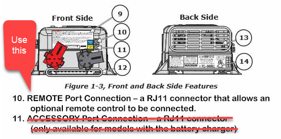
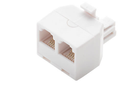
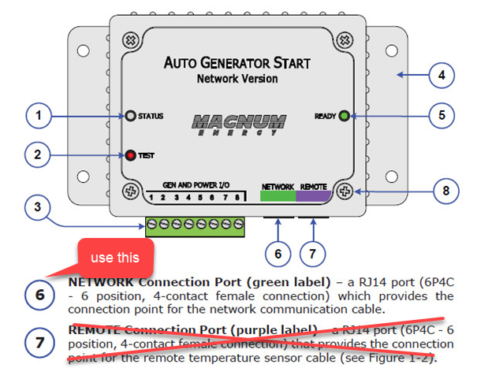
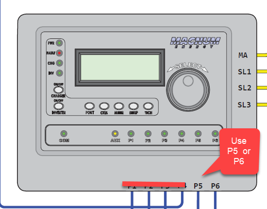
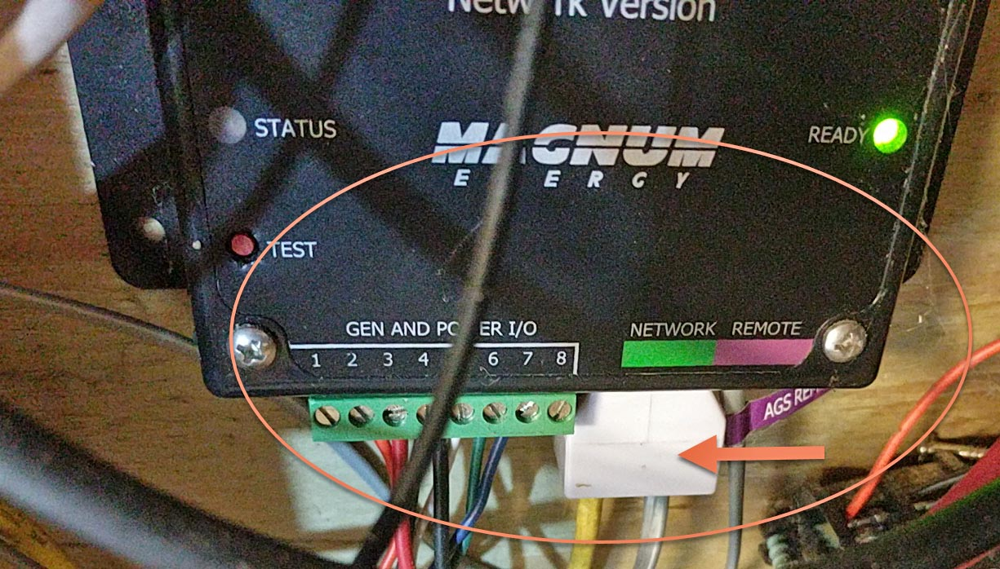
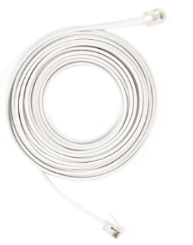
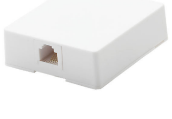
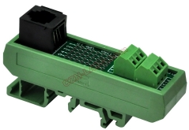
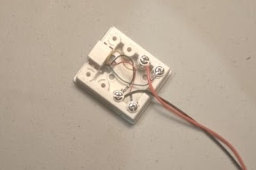
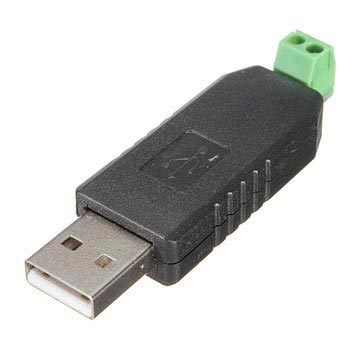
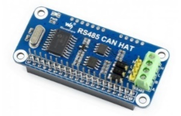
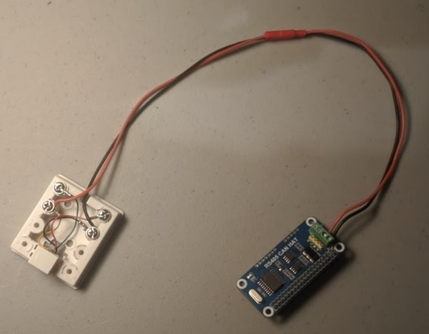
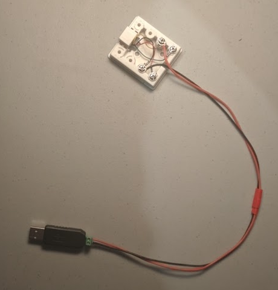
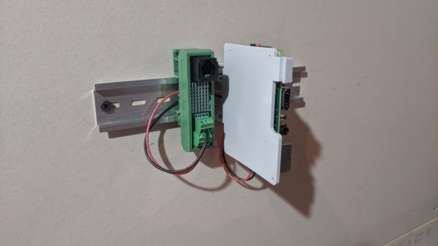
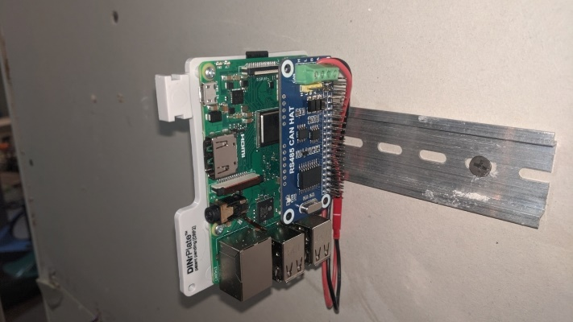
